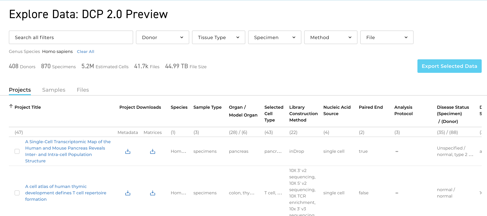

# HCA DCP 2.0 Data Matrix Overview 

The DCP 2.0 Preview provides cell by gene count matrices for each project processed with standardized pipelines. Additionally, any researcher who contributes HCA data may optionally provide a [Contributor Generated Matrix](#contributor-generated-matrices) for their project. 

When available, both matrix types can be downloaded from the Data Browser or the individual Project page. This overview describes the matrix types, how to download them, and how to link them back to the metadata.

## DCP Generated Matrices
After data is processed with standardized DCP pipelines, two types of cell by gene matrices are available for download depending on the library construction method (10x vs. Smart-seq2):

| Matrix Type | Description |
| --- | --- |
| project-level matrices | Matrices for a project that have been separated by species (human or mouse), organ, and library construction method (10x or SS2). These matrices have filenames in the format `<project_description-species-tissue-sequencing_method>` (i.e. `sc-landscape-human-liver-10XV2.loom`)|
| library-level matrices | Matrices for a project that are split by library preparation. All samples in this matrix will have the same ID listed in the matrix metadata field `sequencing_process.provenance.document_id` and the matrix filename will match this ID |

#### What's in the DCP Generated Matrix? 

All DCP 2.0 cell by gene matrices are in Loom file format (see [Loom documentation](http://linnarssonlab.org/loompy/index.html#) for format details) and contain standard [metrics](/pipelines/hca-pipelines/data-processing-pipelines/qc-metrics) and counts that are specific to the data processing pipeline used to generate the file. 

> For the most up-to-date information on counts and metrics, see the Matrix Overviews for the **[Smart-seq2 Pipeline](https://broadinstitute.github.io/warp/documentation/Pipelines/Smart-seq2_Multi_Sample_Pipeline/Loom_schema.html)** and the **[Optimus Pipeline](https://broadinstitute.github.io/warp/documentation/Pipelines/Optimus_Pipeline/Loom_schema.html) (10x data)**.

DCP 2.0 matrices (Loom files) have three types of attributes containing metadata and metrics:
- **global**: information that applies to all data in the Loom (i.e. pipeline version, etc.)

- **row**: gene-specific information and metrics (one row = one gene)

- **column**: cell-specific information and metrics (one column = one cell)

#### DCP Project-level Matrices
All datasets processed with standardized pipelines have project-level matrices (in Loom file format) that are divided by **species**, **organ**, and **sequencing method**. 

> For 10x datasets, the project-level matrices have been minimally filtered based the number of UMIs (only cells with 100 molecules or more are retained).

DCP project-level matrices contain all the processing pipeline's standard metrics and counts, but additionally have HCA metadata included in both global and column attributes which may be useful when exploring the data and linking it back to the additional Project metadata in the Data Manifest. 

HCA metadata is detailed in the global attributes of the project-level DCP Generated Matrix (see table below). Read more about each metadata field in the [Metadata Dictionary](/metadata/). 

| Metadata Attribute Name in DCP Generated Matrix | Metadata Description | 
| --- | --- |
| `donor_organism.genus_species` | Species information; human or mouse |
| `library_preparation_protocol.library_construction_approach` | Technology used for library preparation, i.e 10x or SS2 |
| `specimen_from_organism.organ` | Organ |	
| `project.project_core.project_name` | Project name |
| `project.provenance.document_id` | Project id |
| `input_id` | Metadata values for  `sequencing_process.provenance.document_id` |
| `input_name` | Metadata values for `sequencing_input.biomaterial_core.biomaterial_id` |

More information about HCA post-processing for the project-level matrices can be found in the Matrix Overview for the [Optimus pipeline](https://broadinstitute.github.io/warp/documentation/Pipelines/Optimus_Pipeline/Loom_schema.html#hca-data-coordination-platform-matrix-processing) and the [Smart-seq2 Pipeline](https://broadinstitute.github.io/warp/documentation/Pipelines/Smart-seq2_Multi_Sample_Pipeline/Loom_schema.html#table-2-column-attributes-cell-metrics)(in development). 

#### DCP Library-level Matrices 
Library-level matrices (Loom files) contain the same gene (row) metrics, cell (column) metrics and counts as the project-level matrices, but are separated by the library preparation metadata (the field `sequencing_process.provenance.document_id`).

These matrices do not contain all the species, organ, and library HCA metadata that is included in the project-level matrices. Instead, they only contain the metadata for `input_id` and `input_name`. 

## Contributor Generated Matrices
Contributor generated matrices are optionally provided by the data contributors. When available, you can download them from the individual Project page. The matrices will vary in file format and content. For questions about the Contributor Generated Matrix, reach out to the contributors listed in the Project page Contact section.

## Downloading Matrices
Project-level matrices (both DCP-generated and contributor-generated) may be downloaded from the "Matrices" column of the DCP Data Browser (see image below) or alternatively, from the individual Project page. Additionally, you can use a curl command to download all matrices (contributor-generated and DCP-generated) as described in the [Accessing HCA Data and Metadata](/quick-start-guide) guide.

## Linking Project-level DCP Generated Matrices to the Data Manifest (Metadata)
Project-level matrices only contain some of the available project metadata (species, organs, library methods, etc.). However, there are several metadata facets that you might want to link back to the matrix such as disease state or donor information. 

To link back to the metadata matrix, use the matrix `input_id` field. This field includes all the values for the HCA metadata `sequencing_process.provenance.document_id`, the ID used to demarcate each library preparation. 

