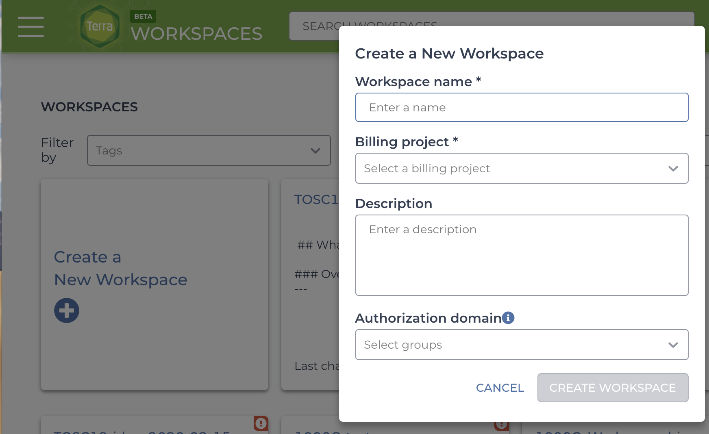
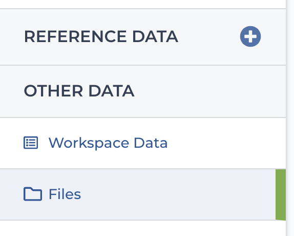
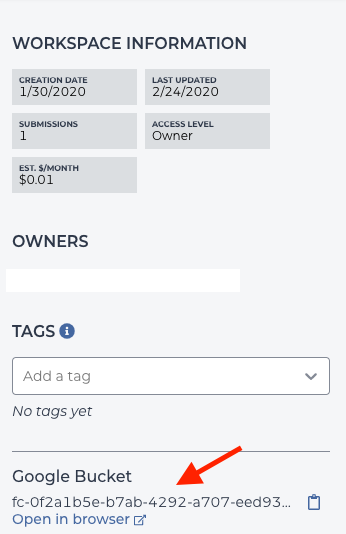

#  Clustering, differential expression analyses, and data visualization using the Cumulus workflow. 
This tutorial covers how to process a DCP loom for clustering, differential expression, and visualization using the Cumulus workflow in a Terra workspace. We will use the same [methods](insert links) outlined for the DCP March 2020 Release. All projects for the release were divided into individual datasets which are listed on the [DCP Release Page](INSERT LINK). For this tutorial, we will use the sample dataset 2020-Mar-Landscape-Adult-Liver-10x derived from the project [“Dissecting the human liver cellular landscape by single cell RNA-seq reveals novel intrahepatic monocyte/ macrophage populations”](https://data.humancellatlas.org/explore/projects/4d6f6c96-2a83-43d8-8fe1-0f53bffd4674). You can explore other datasets and repeat these analyses on additional loom files.

## Downloading DCP loom files
1. Navigate to the [DCP Release Page](INSERT LINK)
2. Download the dataset with the ID: 2020-Mar-Landscape-Adult-Liver-10x.loom file (You can also find this file by going directly to the dataset download page [here](INSERT FILE)

## Creating a Terra Workspace
[Terra](app.terra.bio) is a cloud platform for bioinformatic analyses. For this tutorial, you will need to setup a Google account and Billing project in order to create or use a Terra workspace. If you are new to working with Terra, we recommend the following relevant links for getting started:
- [Navigating in Terra](https://support.terra.bio/hc/en-us/articles/360022704371)
- [Importing a workflow from Dockstore](https://support.terra.bio/hc/en-us/articles/360039827191)
- [Billing](https://support.terra.bio/hc/en-us/articles/360026182251)

#### 1. Go to app.terra.bio and select the “View Workspaces” card

#### 2. Select the “Create a New Workspace” card
#### 3. Fill out a unique workspace name and billing information. You can also optionally add a description of the workspace purpose. You can also optionally fill out the authorization domain. If you are unsure about his field, you can read more information in [this article](https://support.terra.bio/hc/en-us/articles/360026775691)

#### 4. Upload your loom file to the workspace google bucket
Each Terra workspace you create comes with its own google bucket. 
4.1 Go to the Data tab
4.2 In the “Other Data” section, select the Files option

4.2 Click the plus icon to upload the loom file to workspace google bucket.
If you are already familiar with Terra and cloud computing, you can also transfer files using gsutils (see description [here](https://support.terra.bio/hc/en-us/articles/360024056512))

## Uploading Cumulus workflow to Terra workspace
#### 1. Go to Workflows tab of the Terra workspace
#### 2. Select the Find a Workflow card
#### 3. Under “Find Additional Workflows”, select the Broad Methods Repository

This will redirect you to the Broad Methods (you will no longer be in Terra)
#### 4. In the search bar, type “Cumulus” to search for the Cumulus workflow

#### 5. Select the “cumulus/cumulus” option
#### 6. Change the snapshot to 14.

#### 7. Select Export to Workspace
#### 8. Select “Use Blank Configuration”
A new page will appear with a Destinate Workspace drop-down menu. 
#### 9. Select your destination workspace from this menu. 
An option will appear to go to your workspace.You will be redirected back into Terra into the workflow configuration page. 

## Importing a workflow configuration file (JSON)
There are two configuration files available for import depending on which sequencing technology (10x or Smart-seq2)  was used for the dataset of interest. The sequencing technology will be listed on the [Release page](INSERT LINK) next to the dataset. 
You can download the 10x configuration (JSON) [here](INSERT LINK) or the Smart-seq2  [here](INSERT LINK). The 2020-Mar-Landscape-Adult-Liver-10x dataset uses the 10x configuration.

#### 1. Select the upload json link and choose the appropriate configuration file

#### 2. Click Save

| Note about Cumulus workflow configuration |
| :-- |
| The configuration files list the Cumulus workflow parameters, which are detailed in the [Release Methods](INSERT LINK). Using these two configuration files will produce clustered loom and h5ad files, as well as differential expression files. |

## Specifying workflow input and output files

#### 1. Examine the input field of the configuration page. 
You will see that it is expecting a file. You will need to specify the google bucket location for the input loom file. To do this, select the folder icon in the input_file attribute box. Choose the loom. 

##### 2. Examine the output_name attribute. 
You will need to specify a string in quotes that includes the google bucket location, an output folder, and a prefix you would like to give all analysis files. 
- The google bucket location can be found on the right side of the workspace Dashboard tab . 
- We used an output folder called “output”. For a prefix, we used the dataset ID 2020-Mar-Landscape-Adult-Liver-10x . The final string should look like “gs://GOOGLE_BUCKET/output/2020-Mar-Landscape-Adult-Liver-10x.

#### 3. Select save on the configuration page

## Running the workflow

#### 1. On the Workflows configuration page, select the radial button next to “Run workflow with inputs defined by file paths”
#### 2. Select save
#### 3. Select Run Analysis and then Launch

#### 4. You can check the status of your run in the Job History tab

## What you should see after running Cumulus
#### 1. Return the Terra workspace Data tab.
#### 2. In the Files section, select the output folder

#### 3. You should see the now processed data files. 
Although these files are processed for clustering and differential expression, they are still unannotated. 

## Annotating Release Files
This section is in-progress. More details to come! See the [Working with Release Files guide](INSERT LINK) for details about creating your own annotations in Single Cell Portal.

## Next steps
