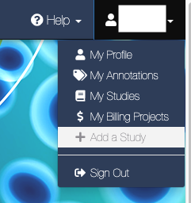
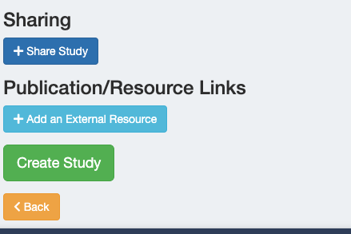

# Working with Release Files 

There are multiple tools available to view and manipulate the March 2020 Release files. This guide focuses on importing release files into Python and R-supported software such as Pegasus, Seurat, and Scanpy, in addition to visualizing and annotating files in Single Cell Portal. We will use the [2020-Mar-Landscape-Adult-Liver-10x](INSERT LINK TO RELEASE PAGE) dataset as an example, but the following techniques will work for all Release datasets. The software we use is only a subset of single-cell analysis tools; we encourage the community to explore these files using other portals and tools as they become available!

If you would like to know more about how these release files were generated, please see [March 2020 Release Methods] or take the [analysis tutorial](INSERT LINK) which demonstrates how to replicate Release analyses using the 2020-Mar-Landscape-Adult-Liver-10x Release dataset. 

## Importing annotated release files into R and Python visualization resources

Use the suggested code below to view the annotated Cumulus output loom and h5ad files in [Pegasus](https://pegasus.readthedocs.io/en/latest/), [Seurat](https://satijalab.org/seurat/), and [SCANPY](https://github.com/theislab/scanpy). You can find more details about importing Cumulus outputs into these resources from the [Cumulus documentation](https://cumulus.readthedocs.io/en/latest/cumulus.html#load-cumulus-results-into-pegasus). 

### Pegasus 
[Pegasus](https://pegasus.readthedocs.io/en/latest/) is a Python package used by Cumulus for analyzing very large single-cell transcriptomes. The following 2020-Mar-Landscape-Adult-Liver-10x examples were tested using Python v.INSERT and Pegasus v.INSERT. 

In Python, load the annotated h5ad output file using:

```Python
import pegasus as pg
adata = pg.read_input("2020-Mar-Landscape-Adult-Liver-10x_annotated_v1.h5ad")
```

Load the annotated output loom files using:

```Python
import pegasus as pg
data = pg.read_input("2020-Mar-Landscape-Adult-Liver-10x_annotated_v1.loom", genome = "GRCh38")
```
### Seurat 
 [Seurat](https://satijalab.org/seurat/) is an R package used for single-cell data quality control, analysis, and exploration. The following examples were tested using R v.INSERT with Python v.INSERT.

Load the annotated Cumulus h5ad files using:

```R
ad <- import("anndata", convert = FALSE)
test_ad <- ad$read_h5ad("2020-Mar-Landscape-Adult-Liver-10x_annotated_v1.seurat.h5ad")
result <- convert_h5ad_to_seurat(test_ad)
```
To load the Cumulus output loom file, you must first install the LoomR v.INSERT package:

```R
install.package("devtools")
devtools::install_github("mojaveazure/loomR", ref = "develop")
```
Next, load the loom file.

```R
source("https://raw.githubusercontent.com/klarman-cell-observatory/cumulus/master/workflows/cumulus/loom2seurat.R")
> result <- convert_loom_to_seurat("2020-Mar-Landscape-Adult-Liver-10x_annotated_v1.loom")
```
### SCANPY
[SCANPY](https://github.com/theislab/scanpy) is a Python-based analysis toolkit for single-cell expression data built with [anndata](https://anndata.readthedocs.io/en/stable/). The following 2020-Mar-Landscape-Adult-Liver-10x examples were tested using Python v.INSERT and SCANPY v.INSERT. 

Load the annotated Cumulus h5ad output file using:

```Python
import scanpy as sc
adata = sc.read_h5ad("2020-Mar-Landscape-Adult-Liver-10x_annotated_v1.seurat.h5ad")’
```
```Python
Load the annotated Cumulus h5ad loom file:
import scanpy as sc
adata = sc.read_loom("2020-Mar-Landscape-Adult-Liver-10x_annotated_v1.loom")
```

## Loading differential expression results in R or Python
Differential expression analyses were performed on the louvain cell clusters identified with the Cumulus workflow (see the [Methods page](INSERT LINK). For each Release dataset, there are two files containing differential expression results:
-  a .de.xlsx 
-  a CSV.zip

Each louvain cluster in the .de.xlsx file has one excel sheet for upregulated genes and one for downregulated genes. To make viewing these results easier in R and Python, we converted all excel sheets into a zip of individual CSV files. You can download the zip file from the project release page (see [here](INSERT LINK) for the 2020-Mar-Landscape-Adult-Liver-10x dataset), unzip it into your directory of choice, and view the CSVs in R or Python using the instructions below.

For both R and Python instructions, you will need to specify the name of the directory containing the CSV files (specified below with “DIRECTORY_NAME”).

### Instructions for R

```R
setwd("/path/to/folder/with/directory/")
input_dir <- 'DIRECTORY_NAME'
files_to_load <- list.files(input_dir, full.names=TRUE)
names(files_to_load) <- unlist(lapply(strsplit(basename(files_to_load),'.',fixed=T),'[',1))
de <- lapply(files_to_load, read.csv)
```
### Instructions for Python
These instructions use [pandas software](https://pandas.pydata.org/) to read the CSV files. You will need to have pandas installed. To begin these steps, use Terminal to navigate to the directory containing your output folder (DIRECTORY_NAME). The output folder should have all the CSV files in it. 

```Python
import os
import pandas as pd
input_directory = "DIRECTORY_NAME"
file_list = os.listdir(input_directory, )
data = dict()
for f in file_list:
	data[f] = pd.read_csv(input_directory + '/' + f)
data[f]
```

## Creating a Single Cell Portal study page and importing Cumulus results
You can visualize or annotate DCP Release files by either using the existing studies in [Single Cell Portal](https://singlecell.broadinstitute.org/single_cell?scpbr=human-cell-atlas-march-2020-release) or by creating a new Single Cell Portal Study. Specific instructions for getting started with Single Cell Portal can be found on the [Single Cell Portal wiki]( https://github.com/broadinstitute/single_cell_portal/wiki/Synchronizing-Study-Data). You will need a Google compatible email account to login. If your institutional account is backed by Google, you may use it.

**The following instructions are a continuation from the [analysis tutorial](INSERT LINK) and focus on importing Cumulus output files from an existing Terra workspace. These steps use the 2020-Mar-Landscape-Adult-Liver-10x example files derived from the [analysis tutorial](INSERT LINK). ** 


### Creating a Single Cell Portal Study

#### 1. Navigate to [Single Cell Portal](https://singlecell.broadinstitute.org/single_cell) and login.

#### 2. Go to the profile drop-down menu and select “Add Study”


#### 3. You will need to select a unique name for the study page and billing information (note that if you want to import files from a Terra workspace, the billing information must match the billing information used on Terra). 


#### 4. Select Yes for using an existing Terra workspace. 

#### 5. Enter the Terra workspace name in the Existing Terra Workspace field. \For the 2020-Mar-Landscape-Adult-Liver-10x dataset, you would use “2020-Mar-Landscape-Adult-Liver-10x”.

#### 6. Scroll to the bottom of the page and select “Create Study”.


#### 7. Select the files you would like to import. 

*While some of these files are necessary to Single Cell Portal functionality, others files, like differential expression analyses, are often shared with colleagues. The table below lists all necessary and recommended files. Additionally, for some Single Cell Portal files, the order of import is important. We have noted this in the Notes section of the table.*

| File Name | Description | File type | Notes |
|---|---|---|---|
| 2020-Mar-Landscape-Adult-Liver-10x.loom | Loom file generated by the HCA Matrix service and used as input to the Cumulus pipeline. | Other | --- |
| output/2020-Mar-Landscape-Adult-Liver-10x.de.xlsx | Differential expression with correction (Cumulus output) | Other | --- |
| output/2020-Mar-Landscape-Adult-Liver-10x.filt.xlsx | File describing cumulus filtering information | Other | ---  |
| output/2020-Mar-Landscape-Adult-Liver-10x.loom | Contains Clustering information (Pegasus, Scanpy, and Seurat compatible) | Other | This is output loom file is not annotated  |
| output/2020-Mar-Landscape-Adult-Liver-10x.scp.X_diffmap_pca.coords.txt | Diffusion map coordinates | Cluster | This file is necessary Single Cell Portal visualization; Specify 3 axis labels as “Diffmap n” where n=1,2,3 |
| output/2020-Mar-Landscape-Adult-Liver-10x.scp.X_fitsne.coords.txt | FIt-SNE coordinates | Cluster | This file is necessary for Single Cell Portal visualization; Specify axis labels as “FIt-SNE n”, where n=1,2 |
| output/2020-Mar-Landscape-Adult-Liver-10x.scp.X_fle.coords.txt | fle cluster coordinates | Cluster | This file is necessary for Single Cell Portal visualization; Specify axis labels as ”Fle n”, where n=1,2 |
| output/2020-Mar-Landscape-Adult-Liver-10x.scp.X_umap.coords.txt | UMAP cluster coordinates | Cluster | This file is necessary for Single Cell Portal visualization; Specify axis labels as “UMAP  n” where n=1,2 |
| output/2020-Mar-Landscape-Adult-Liver-10x.scp.matrix.mtx | 10X compatible mtx expression file | MM Coordinate Matrix | This file is necessary for Single Cell Portal. Must import before the other 2 10X compatible import files (Taxon is Human) |
| output/2020-Mar-Landscape-Adult-Liver-10x.scp.barcodes.tsv | 10X compatible barcodes file | 10X compatible barcodes file | This file is necessary for Single Cell Portal; Must import after .matrix.mtx file |
| output/2020-Mar-Landscape-Adult-Liver-10x.scp.features.tsv | 10X compatible features (genes) file | 10X Genes Files | This file is necessary for Single Cell Portal; Must import after .matrix.mtx file |
| output/2020-Mar-Landscape-Adult-Liver-10x.scp.metadata.txt | Metadata matrix | Metadata |  |
| output/2020-Mar-Landscape-Adult-Liver-10x.seurat.h5ad | Seurat compatible output containing clustering information (Cumulus output) | Other | ---  |

### Annotating cells in Single Cell Portal
Note that the DCP used publications and suggestions from project contributors for cell annotations, but we encourage researchers to explore and create new annotations. Here is a link to a Single Cell Portal [cell annotation guide](https://github.com/broadinstitute/single_cell_portal/wiki/Annotations).
